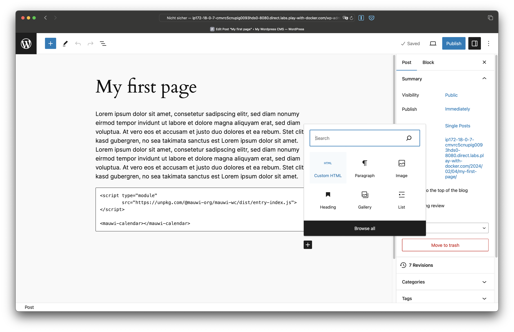

[](https://github.com/mauricewipf/mauwi-wc/actions/workflows/deploy-github-pages.yaml)

# mauwi-wc (Web Components)

mauwi-wc is a UI Components Library to build customizable websites and web applications. It is based on the Open Web Standard [Web Components](https://developer.mozilla.org/en-US/docs/Web/API/Web_components) and is built with [Lit Elements](https://lit.dev).

## Installation

`npm install`

## How to create a new component

1. Create a file "src/my-element/my-element.ts"
2. Create a file "src/my-element/index.ts" with the content:

```
export { MyElement } from '/my-element';
```

3. Add the following to the file src/index.ts:

```
export { MyElement } from './my-element/my-element';
```

4. In vite.config.js add `'my-element': src/my-element/index.ts'`.

5. Use `mauwi-my-element` in index.html.

## Development

Start development server:

`npm run dev` 

Watch CSS class changes and generate new treeshaked tailwind:

`npm run generate-tailwind`

Start Storybook:

`npm run storybook`

## Publish

1. `npm run build`
2. `npm run publish`

## Integration

### In CMS like Wordpress, Drupal and alike

Add a **Custom HTML** block to your page with the following lines of code:

```html
<script type="module" src="https://unpkg.com/@mauwi-org/mauwi-wc/dist/entry-index.js"></script>

<!-- The custom web component you want to insert -->
<mauwi-calendar></mauwi-calendar>
```



### In HTML via CDN

```html
<!-- HTML -->
<script type="module" src="https://unpkg.com/@mauwi-org/mauwi-wc/dist/entry-index.js"></script>

<!-- Or specify version -->
<script type="module" src="https://unpkg.com/@mauwi-org/mauwi-wc@0.0.3/dist/entry-index.js"></script>

<!-- Or load only specific web component -->
<script type="module" src="https://unpkg.com/@mauwi-org/mauwi-wc/dist/entry-bar-chart.js"></script>

<!-- Finally use custom tag -->
<mauwi-bar-chart></mauwi-bar-chart>
```

### In NPM project via NPM

1. In Terminal or Console:

`npm install @mauwi-org/mauwi-wc`

2. In HTML

```html
<!-- HTML -->
<script type="module" src="node_modules/@mauwi-org/mauwi-wc/dist/entry-index.js"></script>

<!-- Or load only specific web component -->
<script type="module" src="node_modules/@mauwi-org/mauwi-wc/dist/entry-bar-chart.js"></script>

<!-- Finally use custom tag -->
<mauwi-bar-chart></mauwi-bar-chart>
```

### In React project

1. In Terminal or Console:

`npm install @mauwi-org/mauwi-wc @lit/react`

2. In JSX

https://lit.dev/docs/frameworks/react/

```jsx
import React from 'react';
import {createComponent} from '@lit/react';
import {MauwiElement} from './mauwi-element.js';

export const MauwiElementComponent = createComponent({
  tagName: 'mauwi-element',
  elementClass: MauwiElement,
  react: React,
  events: {
    onactivate: 'activate',
    onchange: 'change',
  },
});
```

3. Use React component

```jsx
<MauwiElementComponent
  active={isActive}
  onactivate={(e) => setIsActive(e.active)}
  onchange={handleChange}
/>
```

## Further reading

- Inspired by [shadcn UI](https://ui.shadcn.com/)
- Based on: [butopen/web-components-tailwind-starter-kit](https://github.com/butopen/web-components-tailwind-starter-kit)
